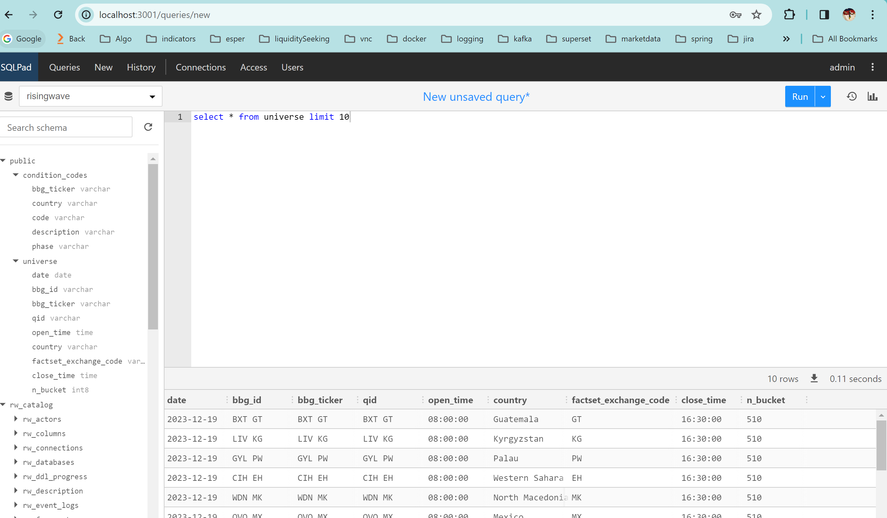

# a word on the data model

We look at generating fake trades for financial instruments.

- Every instrument has a unique identifier, the bbg_id and a bunch of others fields. 
- Every instrument belongs to a country and every country has its own market hours and phases. 
- The country condition codes are used to map out the trade condition codes into a human-readable phase (opening_auction, continuous, closing_auction)


# build the producer

```shell
cd producer
docker build . -t producer
```

# bring up the stack
 
```shell
vagrant up
vagrant ssh
cd /vagrant
docker-compose up -d
```

# check that universe and condition_codes are populated in risingwave

## connect to sqlpad by creating a risingwave data source


## query universe




# check that data is being inserted into trade topic

http://localhost:8080/topics


